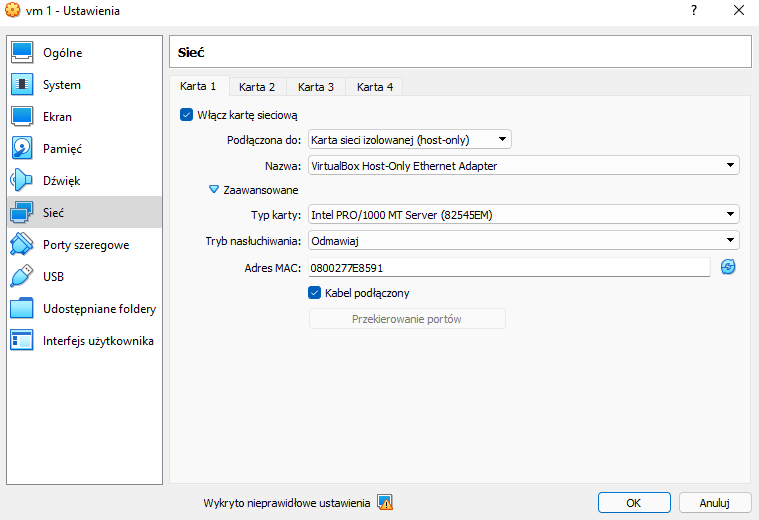
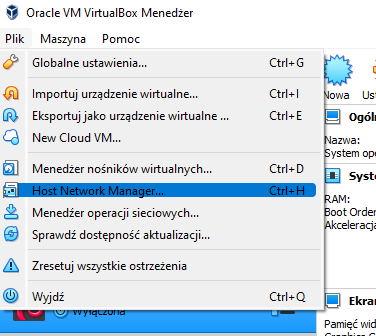
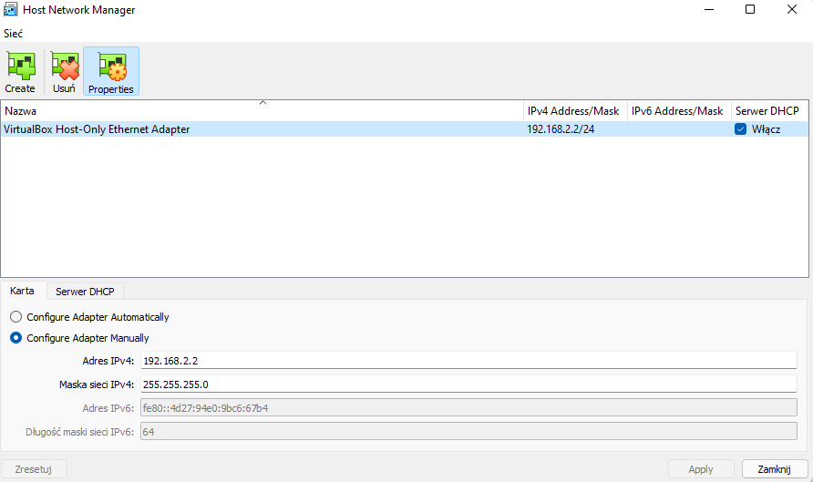
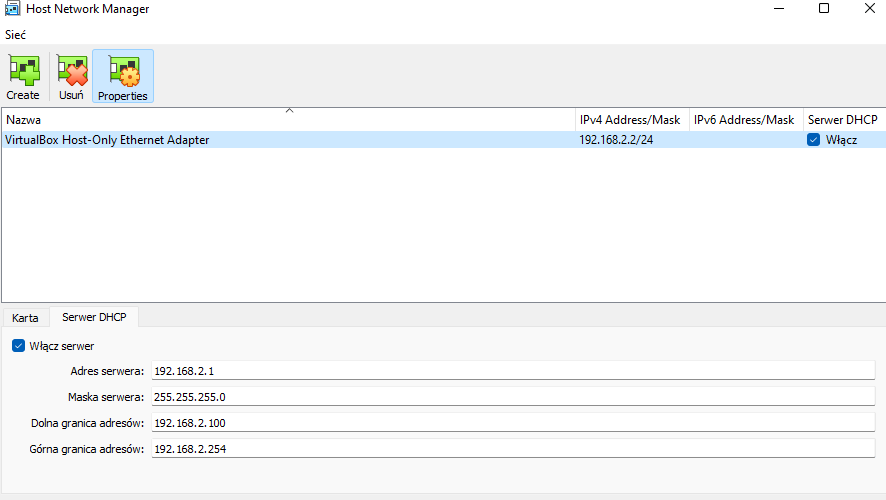

# Przygotowanie środowiska do pracy

Zalecamy wykonać to laboratorium na systemie Kali Linux. Konieczna będzie również maszyna wirtualna VirtualBox z serwerem. Celem laboratorium jest włamanie się do niniejszego serwera.

Link do maszyny wirtualnej: https://drive.google.com/file/d/1UynHpPUkgQfgE4Mkb529auMs4FjkCi6L/view?usp=sharing

Instalacja VirtualBoxa na Kalim:
```
sudo apt-get install virtualbox
```
Możliwe, że wcześniej trzeba będzie wykonać polecenie:
```
sudo apt-get update
```
Link do obrazu maszyny Kaliego: https://kali.download/virtual-images/kali-2021.4a/kali-linux-2021.4a-virtualbox-amd64.ova

## 1. Importowanie
1.1. Wybierz plik vm.ova w VirtualBoxie - powinno wystarczyć dwukrotne kliknięcie na plik

1.2. Nie zmieniaj ustawień domyślnych, kliknij Import

## 2. Konfiguracja maszyny

2.1. Prawy klawisz myszy na maszynę vm > Ustawienia


2.2. Wejdź w sieć i ustaw jak poniżej (host-only)



2.3. Plik > Host Network Manager



2.4. Ustawiamy adresacje, np. jak poniżej (karta oraz serwer DHCP)





W tej chwili 192.168.2.2 jest adresem adaptera wirtualnego po stronie hosta a 192.168.2.1 zostaje przypisany jako serwer DHCP VirtualBox’a. w VirtualBox Host-Only Ethernet Adapter będzie używana sieć 192.168.2.0/24.

# Gotowe! Zapraszamy do wykonania [laboratorium](https://github.com/tkozl/BAWiM_proj#readme) :)
